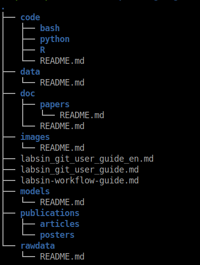
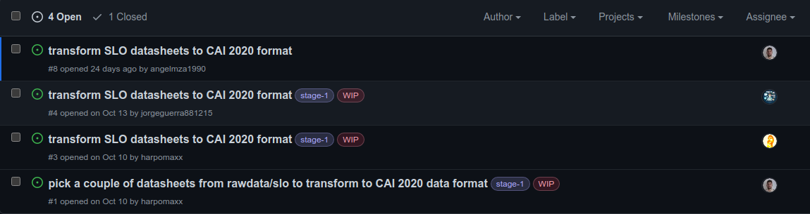
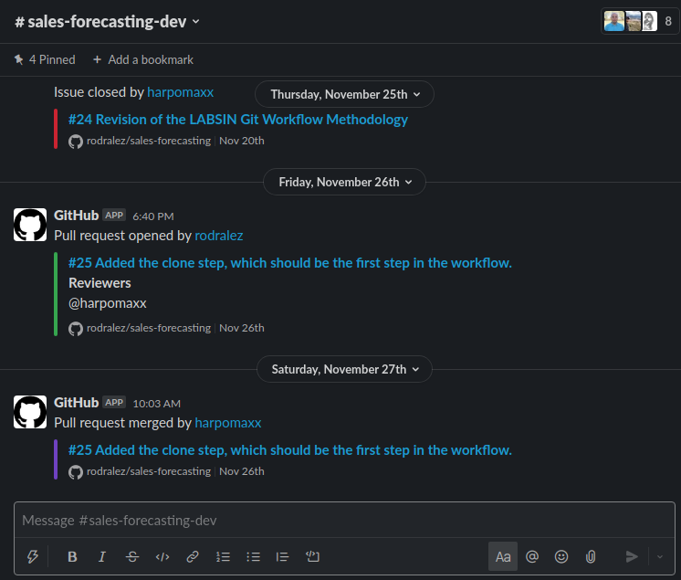

> Thanks to [Juanma Romero](https://www.linkedin.com/in/juanmanuelromero-1899/), [Tincho Marchetta](https://www.linkedin.com/in/mmarchetta/) and [Rodralez](https://twitter.com/RGonzalez_PhD) from [LABSIN](https://labsin.org) for point me to most of the rules and procedures described in this post.

## A common scenario

Using **Source code Management** (SCM) tools for conducting a development process is basically the way to go in the software industry. Let be me clear: *Not using such tools is basically insane!* [SCM](https://en.wikipedia.org/wiki/Software_configuration_management) tools are usually integrated into some kind of web application and they provide much more than just simple collaborative access to code and code versioning. You usually have access to some sort of ticket tracking system, a continuous integration (CI) tool, among others. [Github](https://github.com), [GitLab](https://gitlab.com), and [bitbucket](https://bitbucket.org) are good examples of these kinds of tools. (I'm pretty sure you have heard about them 😜).

The Software Industry has well-defined standards and procedures which are heavily based on tools such as Gitlab. The [Github flow](https://docs.github.com/en/get-started/quickstart/github-flow), for instance, is a good example of some of the procedures applied in collaborative software development.  
However, in research sometimes we follow a more relaxed and not structured way to do our job. Don't get me wrong, of course, we use SCM tools (sometimes) for keeping track of our code. But, since research could be a lonely task, we tend to relax the standards. Every researcher is free to work the way he wants. Usually, the research topics are so complicated in their own way, that forcing the use of a procedure or specific tools is left aside. Such behavior could a big problem when a new member wants to join a particular project. An infamous research scenario is someone trying to join a project and not finding the last version of a particular model (the one the team published last year)l, nor the code that implemented it.

> ## ***The data capture process, the data analysis is certainly rigorous, the software... well that is a completely different story.*** {style="color:gray"}

If you think a little bit about it, you can say it sounds ridiculous, a researcher that doesn't follow a rigorous methodology? Well, the data capture process and the data analysis are certainly rigorous, **the software**... well that is a completely different story. This behavior has started to change with journals and conferences asking for the code. More recently, sites like [Papers with Code](https://paperswithcode.com/) have started forcing researchers to be more careful when coding.

At [LABSIN](https://labsin.org) we have started exploring the application of these tools as a fundamental part of our daily research. In the rest of this post, I will discuss how we applied several ideas from software development to our research process. So if you have experience in the software industry this post could be a little be boring for you!

## The recommended repository structure.

Every new research project should have a repository on Github. Depending on the kind of research project, the Github repo could be **private** or **public**. The general idea of the repository is to include all the data related to the given research project. Not only the code but also all the resources used in the project. So you need to include a link to every important paper, book, video or internet article useful for the project in the repository. The contributions (aka publications) should be also included in the repository. Not only the PDF version but also the source (latex, word, markdown, etc.)

In the figure below, you can find a preliminary directory structure template we use every time we start a new research project. Please keep in mind this is very data-science oriented.

In the `rawdata/` folder, you should put the data used for the project without any kind of transformation. Since raw data used to be huge, you can simply create a file pointing to the datasets. In case data is stored in some kind of database, then the instruction for accessing the database should be available here.

If you decide to carry out some kind of cleaning, data transformation, etc.), or maybe you want to sample a smaller portion in the data for working in-memory, such data should be stored in the `data/` folder.

In the `code/` folder, you should put the source code for every experiment, study, and developed application related to the research. Since we basically focus on Data Science projects our main languages are `Python,` `R` and `Bash` . How to continue the hierarchy below the language folder? It depends. I personally like to create a new folder for `notebooks/`. Another for `scripts`/ and (if necessary) one more for R `packages/` or`shiny`/ apps.

The `doc/` folder is for all the references used in the project: Books, papers, datasheets, articles, videos, etc. For that, you can use a BibTex file for papers and books and a markdown file for the remaining resources. (In some cases you can include the PDF ).

From time to time you share a chart with your co-workers or a table with partial results. It is a good idea to save them. You never know when you will need it again. For storing these kinds of resources you can use the `images/` folder.

In the `publications/` folder you can store all the publications of the project. We use special directories for `posters/` and `articles/`. Remember, the idea is to also include here all the sources of the publication for further modification.

Finally in the `models/` folder, you should store the results models. Here you can put the plain model object for use when new data become available. Very often models are deployed via some [kind of microservice](https://harpomaxx.github.io/post/deploying-ml-model/) ([Flask](https://flask.palletsprojects.com/en/2.0.x/), [fastAPI](https://fastapi.tiangolo.com/) or [Plumber](https://www.rplumber.io/) for instance). in that case all the code of the microservice should be stored here (as well as [Docker](https://www.docker.com/) files if they are needed).

## The ticket system

GitHub is a great tool for a lightweight ticketing system and we at LABSIN have strongly embraced it. What do I mean by that? Well, the idea is to use the ticket system for everything related to the project and certainly not limited to the code.

Let's say you have to do some literature review. Well, you can create an issue for that, and once you have finished, you can close the issue. Or maybe you have to make a video of the project for presenting to some virtual conference. You create an issue for that, make the video, upload it to the `publications/videos/` folder (or at least create a link pointing to it), and then you can close the issue.

So basically we try to create an issue for every project task. I know it could be excessive, but believe me, when you are working with several research projects in parallel, this could be life-saving. If you need to leave a particular project for a week o so, you can return to it and have a clear idea about the state of the project: what have been done, what is still missing, who is working o what, etc.

> ## ***GitHub is a great tool for a lightweight ticketing system and we at LABSIN have strongly embraced it.*** {style="color:gray"}

Of course, Github provides a method for assigning a particular issue to a member (or members) of the project. But also provides a labeling system for annotating tickets according to your needs. You can establish a priority or maybe the project stage associated with the issue. For instance, we at LABSIN use the **WIP** label for indicating somebody is working on an issue, and also we use labels for indicating the stage of that issue.

You can choose your own way of making use of the ticket system. In the Figure below there is a real example of a LASBIN project we have started recently. In this case issue **\#1** required to all members pick a couple of datasets for doing some transformation. When a member has picked his datasets, he can remove himself from the assignees' list and start a new issue (**\#3**) dedicated to making the actual transformation. This is just one use example...

## Slack Integration

Communication platforms like [slack](https://slack.com/) have become very common today. At LABSIN we Integrated Github project into our slack workspace. The idea is simple: For every new project you have two channels: `#project-name` and `#project-name-dev` . In the first channel, you discuss everything related to the research project, and in the second ( `#project-name-dev)` you focus only on the development aspect of the project. In this last channel, you add the [GitHub slack integration](https://slack.github.com/) for having notifications about each issue, comment, branch, and Pull Request (PR).

By integrating Github repository actions into a project channel you can keep out to date with the last changes in the project discuss every notification, propose a new change or issue, anything you want ...

## The GitHub Flow

GitHub flow is **a lightweight, branch-based workflow**. As GitHub says, this flow is useful for everyone, not just developers. For example, according to [GitHub](https://docs.github.com/en/get-started/quickstart/github-flow), you can use GitHub flow for a site policy, documentation, and roadmap among others. Well, we use it for our research projects.

As I mentioned before, there is nothing new about this methodology so I will discuss it briefly. We are working on a more complete document you can find [here](https://github.com/rodralez/sales-forecasting/blob/develop/labsin-project-workflow-guide-en.md).

### You work hierarchically with 2 branches simultaneously:

`main`: Production branch. Nothing is merged into `main` except there is a strong consensus among all the participants working on the repository. Only the `develop` branch can be merged to the `main` branch.

`develop`: it is the integration branch used by all the branches to merge particular changes.

### For each new feature, create an issue and then create a new topic branch.

For every new feature we need to implement (a portion of a paper, a new function, a modification to the Bibtex file, etc.) you create an issue in the ticket system. Once created you assigned it to some members of your teams. (Let's be realistic, it will be probably you!!). When you (or somebody else) decide to work on a particular issue, you can use a label (**WIP**) or just post a comment on the Github platform and create a new topic branch from `develop` . This is a local copy only available in the local version of the repo. The idea is that you work in this new topic branch and once you have finished out pushed to the remote repository.  

Then, you create a [Pull Request](https://docs.github.com/en/pull-requests/collaborating-with-pull-requests/proposing-changes-to-your-work-with-pull-requests/about-pull-requests) (**PR**) at the [Github](https://github.com) site and wait until other members approve it (hopefully it won't take long 😝). Finally, when the PR is approved, the merge between `develop` and our topic branch is made at the Github site. Finally, if all issues were resolved related to the branch, the branch can be deleted.

### About releases

A release is an official version of the project under development. When we are going to make a release, we typically do a single PR from \`develop\` to \`main\`, check and merge in \`main\`.

Then, the version history is usually kept by adding tags in \`main\` (we can add them in any branch anyway if we need them). The tags are like markers in the history and then if necessary we can create branches off of those tags.

## Just a few more words.

This post is just a first attempt to formalize the methodology for conducting a new research project at [LABSIN](https://labsin.org/) and certainly is a **Work in Progress** per se. So, we are pretty sure a lot of things could be improved and actually WILL BE improved as we continue applying the methodology in our daily tasks. **So be ready for updates.**
